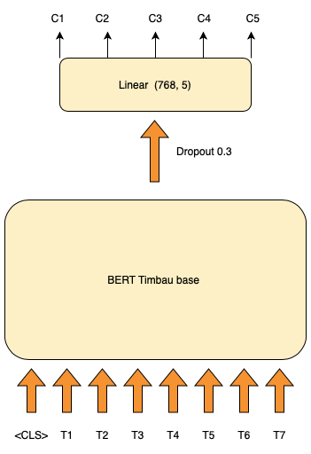

# BERT Enem Grader Model 
### Project Overview📌 

This repository hosts the code and resources for a machine learning project, aiming to develop a transformer-based algorithm for grading essays. Utilizing the [essay-br dataset](https://github.com/rafaelanchieta/essay) for training and the [BERT Timbau model](https://huggingface.co/neuralmind/bert-base-portuguese-cased)

Arxiv preprint: https://arxiv.org/abs/2401.00095

### Prerequisites
- Python 3.8+ 
- PyTorch 1.8+ 
- Transformers library 🤗
- Numpy, Pandas 

### ENEM 📚

The ENEM essay is graded based on five distinct skills, each worth up to 200 points, totaling a maximum of 1000 points.

1) Demonstration of mastery of the standard Portuguese language.
2) Comprehension of the essay theme and development of the topic according to the required textual structure.
3) Selection, relation, organization, and interpretation of information, facts, opinions, and arguments in defense of a point of view.
4) Demonstration of knowledge of the necessary linguistic mechanisms for argumentation.
5) Elaboration of a proposal to solve the problem addressed, respecting human values and considering social diversity.

### Dataset 📓
The "Essay-BR" dataset is a collection of essays written by high school Brazilian students. These essays have been graded by human professionals following the criteria of the ENEM exam, a standardized test in Brazil. The repository, available on GitHub, provides access to these essays, which are primarily in the Brazilian Portuguese language. This dataset can be an invaluable resource for projects focusing on automated essay grading, natural language processing, and other areas of computational linguistics that require real-world, human-graded textual data.

The dataset allows for an extended version of the corpus and includes Python scripts for building the dataset and examples of how to read and process the essays. It also includes details on how the essays are structured and scored, offering insights into the criteria used for grading. This makes it a particularly useful dataset for developing and testing machine learning models aimed at understanding and evaluating written text, especially in the context of educational assessments.

In the processing step of the "Essay-BR" dataset for the essay grading task, a crucial enhancement was made to consider the relationship of the essay text with its corresponding prompt or theme.

The rationale behind this merge was to provide the grading model with a more contextual basis for evaluation. In essay grading, the relevance of the essay content to the given prompt is a significant factor in determining the quality and appropriateness of the response. By incorporating the prompt directly into the input data, the model is better equipped to assess this aspect.

The input format to the model was modified to include both the prompt and the essay text, separated by a special token <SEP>. This token acts as a delimiter, clearly distinguishing the prompt from the essay response in the input data. This approach enables the model to understand and process the prompt and essay as related but distinct components of the input, facilitating a more nuanced and accurate assessment of how well the essay addresses the given prompt.

### Model 💻

  
   
  <em>BERT judging your essay!</em>

The BERTTimbauRegression model is a custom architecture designed for regression tasks, particularly grading essays based on ENEM's five competencies. It employs the neuralmind/bert-base-portuguese-cased pre-trained BERT model for processing Portuguese language texts. The architecture includes a dropout layer with a 0.3 dropout rate to reduce overfitting. The key component is a linear layer with an input size of 768, corresponding to the BERT model's hidden size, and an output size of 5, aligning with the five ENEM competencies. This design facilitates the model to predict continuous scores for each competency based on essay inputs.

The BERTimbau model is a pre-trained BERT model specifically designed for Brazilian Portuguese. It has shown state-of-the-art performance on various downstream NLP tasks such as Named Entity Recognition, Sentence Textual Similarity, and Recognizing Textual Entailment. This model is available in two versions: BERTimbau Base and BERTimbau Large, with the Base model having 12 layers and 110 million parameters, and the Large model having 24 layers and 335 million parameters. It's developed to cater to the linguistic nuances of Brazilian Portuguese and is a valuable resource for NLP tasks in this language domain​

  

### Results 📈 

#### Statistical Analysis On The Test Set
Quadratic Weighted Kappa (QWK):

|    | Model                  |   C1 |   C2 |   C3 |   C4 |   C5 |   Total |
|---:|:-----------------------|-----:|-----:|-----:|-----:|-----:|--------:|
|  0 | Amorim and Veloso 2017 | 0.39 | 0.46 | 0.4  | 0.38 | 0.34 |    0.49 |
|  1 | Fonseca et al. 2018    | 0.44 | 0.48 | 0.42 | 0.47 | 0.38 |    0.53 |
|  2 | BERT_Regression_Base   |  0.69|  0.77|  0.77|  0.83| 0.84 |    0.81 |

Rooted Mean Squared Error (RMSE):

|    | Model                  |   C1 |   C2 |   C3 |   C4 |   C5 |   Total |
|---:|:-----------------------|-----:|-----:|-----:|-----:|-----:|--------:|
|  0 | Amorim and Veloso 2017 | 32.26 | 33.45 | 38.2 | 39.35 | 48.18 |  161.09 |
|  1 | Fonseca et al. 2018    | 32.16 | 33.55 | 38   | 38.32 | 47.66 |  157.33 |
|  2 | BERT_Regression_Base   | 22.76 | 23.07 | 22.05| 24.46 | 27.45 |  76.45  |

### References
1.  [Amorim and Veloso 2017](https://aclanthology.org/E17-4010/)
2.  [Fonseca et al. 2018](https://www.researchgate.net/publication/327223514_Automatically_Grading_Brazilian_Student_Essays_13th_International_Conference_PROPOR_2018_Canela_Brazil_September_24-26_2018_Proceedings)
3.  [Essay-br](https://arxiv.org/pdf/2105.09081)

